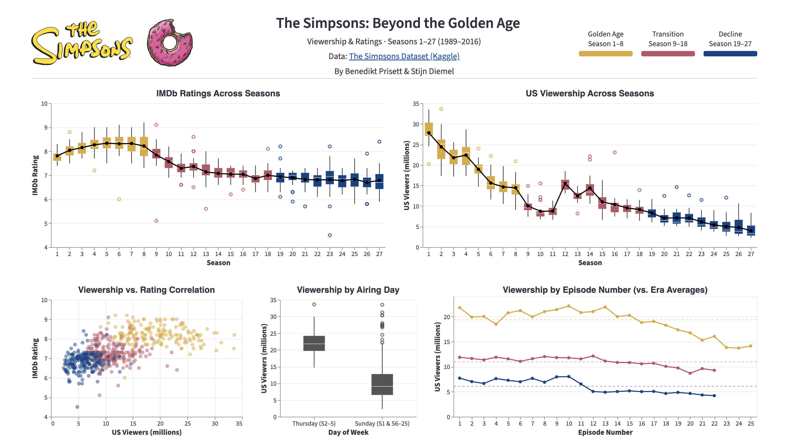

# The Simpsons: Beyond the Golden Age

First project delivery for the Data Visualization course at FIB, Universitat Politecnica de Catalunya (UPC).

**Authors:** Benedikt Prisett & Stijn Diemel

**Key files:**
- [`02_cleaning.ipynb`](02_cleaning.ipynb) -- Data cleaning steps (reproducible)
- [`03_visualization.ipynb`](03_visualization.ipynb) -- All chart designs, iterations, and written explanations per question
- [`streamlit/app.py`](streamlit/app.py) -- Final multi-view dashboard

## Research Questions

This project analyzes The Simpsons dataset (Seasons 1--27, 1989--2016) to answer five questions about how the show's viewership and ratings evolved over time:

1. How have the ratings evolved over time?
2. How have the viewers evolved over time?
3. Is there a correlation between the ratings and the viewers?
4. Are the number of viewers for the episodes related to the weekday they were aired?
5. Do the seasons' number of viewers present any relevant pattern?

A central design decision is the **three-era color scheme** that groups seasons into Golden Age (S1--8), Transition (S9--18), and Decline (S19--27), providing a consistent visual narrative across all charts.

## Dashboard



## Repository Structure

```
.
├── 01_exploration.ipynb            # Data exploration & quality assessment
├── 02_cleaning.ipynb               # Data cleaning (reproducible steps)
├── 03_visualization.ipynb          # Design iterations & final charts per question
├── 03_visualization.pdf            # PDF export of the visualization notebook
├── data/
│   ├── raw_data/                   # Original Kaggle dataset
│   └── clean_data/                 # Cleaned dataset (596 episodes, 9 columns)
├── streamlit/
│   ├── app.py                      # Streamlit dashboard application
│   ├── logo.png                    # Simpsons logo
│   └── donut.png                   # Donut decoration
├── img/
│   ├── q{1-5}_final.png            # Final chart per question
│   └── q{1-5}_iterations/          # Design iteration charts per question
├── dashboard_final.png             # Screenshot of the final Streamlit dashboard
├── Instructions.md                 # Assignment brief
├── pyproject.toml                  # Project metadata & dependencies
└── uv.lock                         # Locked dependency versions
```

## Setup & Run

This project uses [uv](https://docs.astral.sh/uv/) for dependency management with Python 3.13.

```bash
# Install dependencies and run the dashboard
uv sync
uv run streamlit run streamlit/app.py
```

Alternatively, install the dependencies (`streamlit`, `altair`, `pandas`) with your preferred package manager and run:

```bash
streamlit run streamlit/app.py
```

## Data

**Source:** [The Simpsons Dataset](https://www.kaggle.com/datasets/prashant111/the-simpsons-dataset) on Kaggle

The raw dataset contains 600 episodes across 28 seasons. After cleaning (documented in `02_cleaning.ipynb`):

- Dropped Season 28 (incomplete, only 4 of 22 episodes)
- Filled 3 missing viewership values for Season 8 (from Wikipedia)
- Derived the `weekday` column from air dates
- Removed unused columns

The clean dataset contains **596 episodes** with 9 columns covering titles, season/episode numbers, air dates, weekday, IMDb ratings, vote counts, and US viewership figures.

## Technologies

- **[Altair](https://altair-viz.github.io/)** (Vega-Lite) for all visualizations
- **[Streamlit](https://streamlit.io/)** for the interactive dashboard
- **[pandas](https://pandas.pydata.org/)** for data processing
