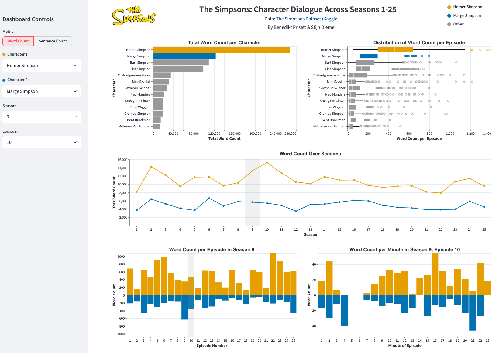

# The Simpsons: Who Talks the Most?

Assignment 2 for the Data Visualization course. Interactive visual analytics tool exploring how the main characters of *The Simpsons* speak across episodes — words and sentences per character, evolution across seasons, and within-episode dynamics.

**Key files:**
- [`02_cleaning.ipynb`](02_cleaning.ipynb) -- Data cleaning steps (reproducible)
- [`03_visualization.ipynb`](03_visualization.ipynb) -- All chart designs, iterations, and written explanations per question
- [`streamlit/app.py`](streamlit/app.py) -- Final multi-view dashboard

## Research Questions

1. Which characters issue the most words, and how is the word distribution shaped?
2. How have the per-character word counts evolved across seasons?
3. For a chosen pair of characters and a chosen season, how does the word distribution unfold across episodes of that season?
4. For the same pair, how does the distribution unfold within a single episode (per minute)?
5. Same as Q1 but for *sentences* rather than words.

A central design decision is the **two-character Okabe-Ito palette** (orange `#E69F00` for Character 1, blue `#0072B2` for Character 2, grey for everything else), used consistently across every chart that compares a pair. Cross-character selection in one view propagates to every other view.

## Dashboard



## Run

```bash
# From the repo root
uv run streamlit run assignment2/streamlit/app.py
```

## Data

The raw dataset (`simpsons_script_lines.csv`, ~158K rows) contains every script line ever uttered, plus stage directions. After cleaning (documented in `02_cleaning.ipynb`):

- Filtered to speaking lines only (~26K stage-direction rows dropped)
- Joined with episode metadata to attach `season` and `number_in_season`
- Dropped rows with corrupted or outlier `word_count` values (CSV-misalignment artifacts)
- Dropped season 26 (incomplete, only 16 of the typical 22 episodes)
- **Canonicalized character names** — collapsed thousands of variants (`"Homer's Brain"`, `"Mutant Burns"`, `"8-Year-Old Bart"`, etc.) onto the 13 main characters; minor characters dropped to keep charts focused
- Aggregated to five question-specific CSVs at the right grain for each chart

The clean dataset is split per question:

| File | Grain | Rows |
|------|-------|------|
| `df_q1.csv` | (character, episode) — words & sentences per episode | 4,723 |
| `df_q2.csv` | (character, season) — words per season | 325 |
| `df_q3.csv` | (character, season, episode-in-season) — words per episode | 7,124 |
| `df_q4.csv` | (character, season, episode-in-season, minute) — words per minute | 153,543 |
| `df_q5.csv` | (character, episode) — sentences per episode | 4,723 |

## Structure

```
assignment2/
├── 01_exploration.ipynb        # Data exploration & quality assessment
├── 02_cleaning.ipynb           # Data cleaning (reproducible steps)
├── 03_visualization.ipynb      # Design iterations & final charts per question
├── data/
│   ├── raw_data/               # Original Kaggle dataset
│   └── clean_data/             # Five per-question CSVs (df_q1.csv ... df_q5.csv)
├── streamlit/
│   ├── app.py                  # Streamlit dashboard application
│   ├── logo.png                # Simpsons logo
│   └── donut.png               # Donut decoration
├── dashboard_final.png         # Screenshot of the final Streamlit dashboard
└── Instructions.md             # Assignment brief
```
